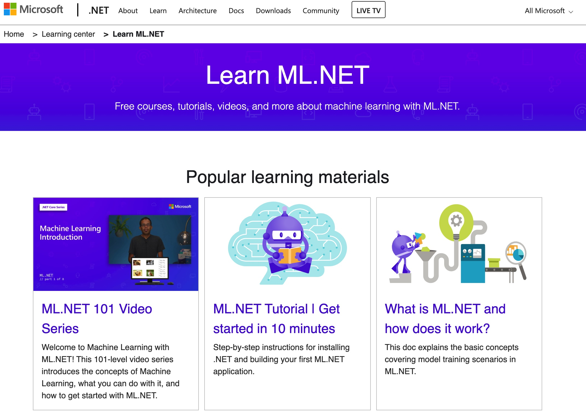

# ML.NET Tutorial - Get started in 10 minutes (macOS)

- by Chris Cui
- created time: 22-Mar-2021



## Create your app
In your terminal, run the following commands:

```bash 
mkdir myMLApp
cd myMLApp
dotnet new console -o consumeModelApp
```

The mkdir command creates a new directory named myMLApp, and the cd myMLApp command puts you into the newly created app directory. The dotnet command creates a new C# application of type console for you. The -o parameter creates a directory named consumeModelApp where your app is stored, and populates it with the required files.

Your model training code will be generated in the upcoming steps.

## Pick a scenario
To generate your model, you need to select your machine learning scenario.

There are several ML scenarios that are supported by the ML.NET CLI:

Classification - Use this when you want to predict which category data belongs in (for example, analyzing sentiment of customer reviews as either positive or negative).
Image classification - Use this when you want to predict which category an image belongs to (for example, predicting if an image is of a cat or a dog).
Regression (for example, value prediction) - Use this when you want to predict a numeric value (for example, predicting house price).
Recommendation - Use this when you want to recommend items to users based on historical ratings (for example, product recommendation).
In this case, you'll predict sentiment based on the content (text) of customer reviews, so you'll use classification.


## Download and add data
Download the Sentiment Labelled Sentences datasets from the UCI Machine Learning Repository. Unzip sentiment labelled sentences.zip and save the yelp_labelled.txt file to the myMLApp directory.

Each row in yelp_labelled.txt represents a different review of a restaurant left by a user on Yelp. The first column represents the comment left by the user, and the second column represents the sentiment of the text (0 is negative, 1 is positive). The columns are separated by tabs, and the dataset has no header.

## Train your model
Now you'll train your model with the yelp_labelled.txt dataset.

In your terminal, run the following command (in your myMLApp folder):
```bash
mlnet classification --dataset "yelp_labelled.txt" --has-header false --label-col 1 --train-time 20
```

What do these commands mean?
- The mlnet classification command runs ML.NET with AutoML to explore many iterations of classification models in the given amount of train time with varying combinations of data transformations, algorithms, and algorithm options and then chooses the highest performing model.

- --dataset: You chose yelp_labelled.txt as the dataset (internally, the CLI will split the one dataset into training and testing datasets).
- --has-header: You use this option to specify if the dataset has a header. In this case, the dataset does not have a header, so it is false
- --label-col: You must specify the target column you want to predict (or the Label). In this case, you want to predict the sentiment in the second column (zero-indexed columns means this is column "1").
- --train-time: You must also specify the amount of time you would like the ML.NET CLI to explore different models, in this case 20 seconds (you can try increasing this number if no models are found after training). Note that for larger datasets, you should set a longer training time.

Progress
While the ML.NET CLI is exploring different models, it displays the following data:

- Start training - This section shows each model iteration, including the trainer (algorithm) used and evaluation metrics for that iteration.
- Time left - This and the progress bar will indicate how much time is left in the training process in seconds.
- Best algorithm - This shows you which algorithm has performed the best so far.
- Best score - This shows you the performance of the best model so far. Higher accuracy means the model predicted more correctly on test data.
- If you want, you can view more information about the training session in the log file generated by the CLI.

## Evaluate your model
After the ML.NET CLI selects the best model, it will display the training Summary, which shows you a summary of the exploration process, including how many models were explored in the given training time.

### Top models
While the ML.NET CLI generates code for the highest performing model, it also displays the top models (up to 5) with the highest accuracy that it found in the given exploration time. It displays several evaluation metrics for those top models, including AUC, AUPRC, and F1-score. For more information, see ML.NET metrics.

## Generate code
The ML.NET CLI adds both the machine learning model and the projects for training and consuming the model to your solution, including:

A .NET console app (SampleClassification.ConsoleApp), which contains ModelBuilder.cs (used to build/train the model) and Program.cs (used to run the model).
A .NET Standard class library (SampleClassification.Model), which contains ModelInput.cs and ModelOutput.cs (input/output classes for model training and consumption) and MLModel.zip (generated serialized ML model).
To try the model, you can run the console app (SampleClassification.ConsoleApp) to predict the sentiment of a single statement with the model.

## Consume your model
The ML.NET CLI has generated the trained model and code for you, so you can now use the model in your other .NET applications (for example, your consumeModelApp console app) by following these steps:

Copy the generated MLModel.zip file from the SampleClassification.Model folder to the consumeModelApp folder.
In the command line, navigate to the consumeModelApp directory.
Terminal
```bash
cd consumeModelApp
Add a reference to the generated class library that contains the trained model and consumption code (SampleClassification.Model) in your consumeModelApp project by running the following command:
```

Terminal

```bash
dotnet add reference "../SampleClassification/SampleClassification.Model/SampleClassification.Model.csproj"
Open the consumeModelApp Program.cs in any code editor and replace the code with the following:
```

Program.cs

```C#
using System;
using SampleClassification.Model;

namespace consumeModelApp
{
    class Program
    {
        static void Main(string[] args)
        {
            // Add input data
            var input = new ModelInput()
            {
              Col0 = "This restaurant was wonderful."
            };

            // Load model and predict output of sample data
            ModelOutput result = ConsumeModel.Predict(input);
            // If Prediction is 1, sentiment is "Positive"; otherwise, sentiment is "Negative"
            string sentiment = result.Prediction == "1" ? "Positive" : "Negative";
            Console.WriteLine($"Text: {input.Col0}\nSentiment: {sentiment}");
        }
    }
}
```

Run your consumeModelApp. You can do this by running the following command in the terminal (make sure you are in the consumeModelApp directory):

Terminal

```
dotnet run
```

The output should look something like this:
```
The output: 'Text: This restaurant was wonderful. Sentiment: Positive
```

## Next steps

Congratulations, you've built your first machine learning model with the ML.NET CLI!

Now that you've used the ML.NET CLI for Classification (specifically sentiment analysis), you can try other scenarios. Try out a Regression scenario (specifically price prediction) using the Taxi Fare dataset to keep building ML.NET models with the ML.NET CLI.


